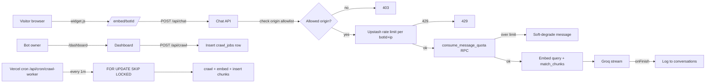

# Real engineering hardening — Helply

## Current state, honestly

The app works end-to-end but every public-facing surface is unprotected. Right now anyone with one of your bot IDs can:

- POST to [src/app/api/chat/route.ts](src/app/api/chat/route.ts) infinitely (no rate limit, `Access-Control-Allow-Origin: *`, no auth) and drain your Groq + Jina free tiers in minutes.
- Pass any `visitorId` and write garbage into your `conversations` and `messages` tables forever.
- If they have an account, POST `url: "http://169.254.169.254/..."` to [src/app/api/crawl/route.ts](src/app/api/crawl/route.ts) and probe internal/cloud-metadata endpoints (classic SSRF).

You also can't enforce the Free / Starter / Pro limits in your pricing UI because there's nothing counting anything.

This plan fixes all of it, in order of urgency, using only free tiers.

## Phase 1 — Security (commit to this one first)

### 1.1 Add Upstash Redis (free tier) for rate limiting & metering

- Sign up at [upstash.com](https://upstash.com) → create a Redis DB → copy the REST URL/token.
- Add to `.env.local` (server-only, no `NEXT_PUBLIC_`):
  ```
  UPSTASH_REDIS_REST_URL=
  UPSTASH_REDIS_REST_TOKEN=
  RATE_LIMIT_SECRET=  # random 32-byte hex, for HMAC signing visitor IDs
  ```
- Install `@upstash/redis` and `@upstash/ratelimit`.
- Create `src/lib/rate-limit.ts` exposing three named limiters:
  - `chatLimiter` — 20 req / 60s per `bot_id + ip`
  - `crawlLimiter` — 10 req / hour per `user_id`
  - `loginLimiter` — 5 magic-link sends / 15min per `email + ip`

### 1.2 Lock down `/api/chat`

In [src/app/api/chat/route.ts](src/app/api/chat/route.ts):

- Extract caller IP from `x-forwarded-for` and call `chatLimiter.limit(...)`; return `429` with `Retry-After` header on block.
- Read `bots.allowed_origins text[]` (new column, see 1.4) and verify `Origin` header is in the list. If not, return `403`. Use `*` allowlist only for plan = free, or skip check if `allowed_origins` is empty during onboarding.
- Replace `Access-Control-Allow-Origin: *` with the matched origin (echo back when allowed).
- Replace client-supplied `visitorId` with a server-signed token: HMAC-SHA256 of `(bot_id, ip, day, ua_hash)` using `RATE_LIMIT_SECRET`. Truncate to 32 chars. Clients can still pass one, but server overwrites it.
- Enforce `messages.length <= 20` and total payload bytes < 32 KB (already partially done via Zod; add explicit byte check).

### 1.3 Lock down `/api/crawl` against SSRF

In [src/lib/crawler.ts](src/lib/crawler.ts), add `assertSafeUrl(url)` called from both `crawlUrl` and `discoverLinks` before the `fetch`:

- Resolve hostname via `dns.promises.lookup` (all addresses).
- Reject if any resolved IP is in: `10/8`, `172.16/12`, `192.168/16`, `127/8`, `169.254/16`, `::1`, `fc00::/7`, `fe80::/10`, `0.0.0.0/8`.
- Reject non-`http(s)` protocols.
- Reject hostnames that are pure IP literals.
- Use the existing 15s timeout + 2 MB cap (already in place — good).
- Disable `redirect: "follow"` and instead follow manually, re-running `assertSafeUrl` on each hop (max 3 redirects).

### 1.4 Add per-bot domain allowlist

New migration `supabase/migrations/0002_security.sql`:

```sql
alter table public.bots
  add column allowed_origins text[] not null default '{}',
  add column plan text not null default 'free' check (plan in ('free','starter','pro')),
  add column monthly_message_count int not null default 0,
  add column monthly_message_period_start timestamptz not null default date_trunc('month', now());

create index if not exists bots_plan_idx on public.bots (plan);

-- Visitor ID is now derived, but we still store the signed token for joining logs.
alter table public.conversations
  add column ip_hash text;
```

In [src/app/dashboard/bots/[id]/bot-detail.tsx](src/app/dashboard/bots/[id]/bot-detail.tsx) add a "Allowed domains" textarea on the Settings tab.

### 1.5 Security headers

In [next.config.ts](next.config.ts) add a global `headers()` entry for `/((?!api|embed).*)`:

- `Strict-Transport-Security: max-age=63072000; includeSubDomains; preload`
- `X-Content-Type-Options: nosniff`
- `Referrer-Policy: strict-origin-when-cross-origin`
- `Permissions-Policy: camera=(), microphone=(), geolocation=()`
- `Content-Security-Policy` — strict on `/dashboard`, relaxed on `/embed/:botId` (already exempt).

Keep `frame-ancestors *` only on `/embed/:botId` (already done — correct).

### 1.6 Login throttling

In [src/app/login/page.tsx](src/app/login/page.tsx) server action: call `loginLimiter.limit(email)` before `supabase.auth.signInWithOtp`. Block at 5 attempts / 15 min.

### Phase 1 acceptance test

I'll write `scripts/abuse-test.ts` that:
1. Spams `/api/chat` 100x — expects ~80 to return 429.
2. POSTs `url: "http://169.254.169.254/latest/meta-data/"` — expects 400.
3. POSTs from a non-allowlisted origin — expects 403.
4. POSTs a forged `visitorId` — expects server to overwrite it (verified by reading conversations table).

---

## Phase 2 — Quota enforcement (makes pricing real)

### 2.1 Atomic counter via Postgres function

New migration `0003_quotas.sql`:

```sql
create or replace function public.consume_message_quota(p_bot_id uuid)
returns table(allowed boolean, remaining int, plan text)
language plpgsql as $$
declare
  b record;
  plan_limit int;
begin
  select * into b from public.bots where id = p_bot_id for update;
  if not found then
    return query select false, 0, 'unknown'::text; return;
  end if;

  -- Reset window if month rolled over
  if b.monthly_message_period_start < date_trunc('month', now()) then
    update public.bots
      set monthly_message_count = 0,
          monthly_message_period_start = date_trunc('month', now())
      where id = p_bot_id;
    b.monthly_message_count := 0;
  end if;

  plan_limit := case b.plan
    when 'free' then 500
    when 'starter' then 5000
    when 'pro' then 25000
    else 500 end;

  if b.monthly_message_count >= plan_limit then
    return query select false, 0, b.plan; return;
  end if;

  update public.bots
    set monthly_message_count = monthly_message_count + 1
    where id = p_bot_id;

  return query select true, plan_limit - (b.monthly_message_count + 1), b.plan;
end $$;
```

### 2.2 Enforce in `/api/chat`

Before calling Groq, `supabase.rpc('consume_message_quota', { p_bot_id: botId })`. If `allowed = false`, return a JSON stream that says "This chatbot has reached its monthly limit. The site owner has been notified." (Soft-degrade, not 402, so the embed widget doesn't look broken on the page.)

### 2.3 Surface usage in the dashboard

In [src/app/dashboard/bots/[id]/page.tsx](src/app/dashboard/bots/[id]/page.tsx) show a Usage tab: current month count, plan limit, simple bar. Email-on-80%/100% via a Supabase Edge Function trigger (free tier).

### 2.4 Lemon Squeezy webhook → plan change

`src/app/api/webhooks/lemon/route.ts`:
- Verify HMAC signature with `LEMON_WEBHOOK_SECRET`.
- On `subscription_created/updated/cancelled` → update `bots.plan` (or a new `users.plan` table, since plans are per-user not per-bot — decide here).
- Idempotency: store `lemon_event_id` in a `processed_webhooks` table.

---

## Phase 3 — Scale (multi-page crawling, retries)

### 3.1 Move crawling out of the request

The current `/api/crawl` blocks the user for up to 60s. Move to a background job pattern:

- Add `crawl_jobs` table: `id, bot_id, source_id, status, attempts, last_error, created_at, started_at, finished_at`.
- `/api/crawl` only enqueues a job (insert row, return immediately).
- Add a Vercel cron `vercel.json` running every minute hitting `/api/cron/crawl-worker`, which picks up to 5 pending jobs, processes them, and updates status. Use `SELECT ... FOR UPDATE SKIP LOCKED` to claim jobs safely with multiple workers.
- Add `CRON_SECRET` env, verify via `Authorization: Bearer ${CRON_SECRET}` header (Vercel cron sets this).

### 3.2 Sitemap & multi-page support

- New `discoverFromSitemap(origin)` in [src/lib/crawler.ts](src/lib/crawler.ts) — fetch `/sitemap.xml`, parse with cheerio, extract URLs. Fall back to `discoverLinks` if no sitemap.
- "Crawl entire site" button on the bot detail page enqueues one job per discovered URL (capped by `bots.plan` limit: 100/1000/10000).

### 3.3 Retry & dead-letter

In the worker:
- Wrap `crawlUrl`+`embedPassages` in retry with exponential backoff (2 attempts).
- On terminal failure, set `status = 'error'` with the message stored. Surface in the dashboard.

### 3.4 Embedding concurrency control

In [src/lib/ai/embeddings.ts](src/lib/ai/embeddings.ts) — batch in groups of 32 (Jina supports up to 128 but smaller batches reduce blast radius on rate limit), with `p-limit` of 2 concurrent calls.

---

## Phase 4 — Observability & operations

### 4.1 Sentry (free tier: 5k errors/mo)

- `@sentry/nextjs` install + `sentry.client.config.ts` / `sentry.server.config.ts`.
- Wrap all `console.error` in [src/app/api/chat/route.ts](src/app/api/chat/route.ts) and [src/app/api/crawl/route.ts](src/app/api/crawl/route.ts) with `Sentry.captureException`.
- Tag with `bot_id` and `plan` for filtering.

### 4.2 Structured logging

Tiny `src/lib/log.ts` that wraps `console.log` to emit JSON lines with `level, msg, bot_id, request_id, latency_ms`. Vercel parses these as structured logs.

### 4.3 Metrics dashboard (in-app, no external tool)

- New `/dashboard/admin` route gated by an `is_admin` flag on `users`.
- Show: total bots, total messages today/week, top bots by usage, error rate from `crawl_jobs`.

### 4.4 Alerts

- Vercel cron `/api/cron/health-check` (every 15 min): query Supabase + Groq + Jina test calls; on failure, send email via Supabase Resend integration (free).
- Sentry alert rule: `error_rate > 5%` over 5 min on `/api/chat`.

### 4.5 Backups

- Supabase free tier already does 7-day point-in-time recovery — verify in dashboard.
- Add weekly Vercel cron `/api/cron/export-conversations` that writes a JSON dump to a private Supabase Storage bucket (defense in depth in case of data corruption).

---

## Architecture after Phase 1+2



---

## What we explicitly skip (for now)

- Custom Postgres replicas — Supabase pooler is enough until ~1M req/mo.
- Multi-region deployment — Vercel edge is fine for the widget.
- Headless-browser crawling (Playwright) — cheerio covers 95% of sites; revisit if real customers ask.
- SOC2 / formal compliance — irrelevant until enterprise customers.
- Self-hosting anything — every chosen tool has a usable free tier.

---

## Execution plan

I commit to **Phase 1 only** when you say "go." Estimated work: ~6–8 file changes plus one migration. Once Phase 1 ships and you confirm it works (I'll provide the abuse-test script), we discuss Phase 2 separately.

If you'd rather start with Phase 2 (because you have a Fiverr client ready to pay and need billing first) or Phase 3 (because a real client has a 200-page docs site), say so and I'll re-order.
